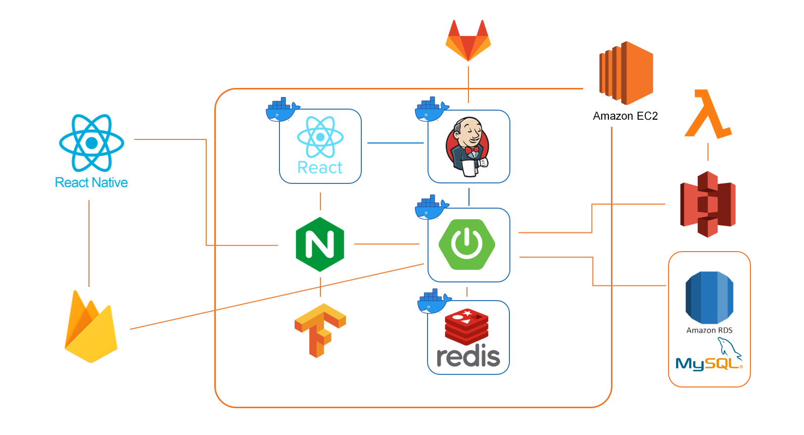

# YoungClimb: 클라이밍 문제풀이 공유 커뮤니티

### 팀명 : 막내온탑

### 서비스 명: 영클라임(YoungClimb)

### 진행 기간

2022.10.10(월) ~ 2022.11.21(월) / 6주

# 목차

1. 기획 배경
2. 서비스 소개
3. 기술 특장점
4. 주요 기능
5. 아키텍쳐
6. 팀 소개

## 1. 기획 배경

- 클라이밍 인구 증가하는 상황
    - 영화 ‘엑시트’ 흥행, 도쿄 올림픽 정식종목 채택 등의 이유로 클라이밍 진입하는 인구 증가
    - **전국 동호인 80만명 추정, 전국 암벽장 300개소 가량**
    - [http://san.chosun.com/news/articleView.html?idxno=13791](http://san.chosun.com/news/articleView.html?idxno=13791)
- 볼더링 문제를 풀 때 답을 찾기 어려운 상황이 있음
    - 대형 클라이밍 커뮤니티의 부재로 인해 대개 인스타그램에 클라이밍 영상을 올리기 때문에, 인스타그램에서 영상을 찾는 경우가 많음
    - 하지만 본인이 원하는 문제의 풀이를 찾기 어려움
    - 혹은 해당 문제를 풀이한 영상이 있더라도 체형이 달라 나의 문제 풀이에 도움이 되지 못하는 경우가 많음
- 이러한 문제점을 해소하고자 문제 풀이를 공유할 수 있는 클라이밍 커뮤니티 sns를 기획함

## 2. 서비스 소개

- 나와 비슷한 체구의 클라이머가 볼더링 문제를 어떻게 풀었는지 찾아보고, 내 풀이 역시 공유할 수 있는 커뮤니티 서비스
    - 릴스를 통한 클라이밍 영상 감상
    - 수도권 실내 클라이밍장들에 대한 영업 정보 및 대표 벽 3D 모델 제공

## 3. 기술 특장점

- Three.js와 Webview를 활용한 벽 이미지 3D 렌더링
- OpenCV 기술을 활용하여 윙스팬 길이 측정
- Docker를 통한 자동 배포
- JWT 활용한 인증 및 인가
- FCM 이용한 앱 푸시알림
- Docker 및 Jenkins 활용한 CI/CD

## 4. 주요 기능

### 영상 게시물 작성 기능

.gif)

- 메인과 프로필에서 영상을 업로드 할 수 있습니다.
- 갤러리에서 비디오를 선택할 수 있습니다.
- 비디오 선택 후 지점, 구역, 난이도, 홀드 색상, 풀이 날짜 그리고 본문을 입력합니다.
- 지점을 선택해야 구역, 난이도, 홀드 색상을 입력할 수 있습니다.
- 지점, 난이도, 홀드 색상, 풀이 날짜는 필수로 입력해야 합니다.
- 구역과 본문은 선택적으로 입력 가능합니다.
- 업로드 시 약 3~5초의 대기시간이 있습니다.

### 유저 추천 기능, 유저 검색 및 팔로우 기능

- 검색 탭에서 유저 검색을 들어갑니다.
- 검색어가 없을 경우 영클라임에서 추천해주는 유저 리스트를 보여줍니다.
- 검색어를 입력하면 검색어에 해당하는 유저들을 보여줍니다.
- 유저 카드를 클릭하면 해당 유저의 프로필로 이동합니다.
- 프로필에서 팔로우 및 팔로우 취소를 할 수 있습니다.
- 팔로우 시 팔로잉, 팔로워 숫자가 즉시 변경됩니다.

### 영상 스크랩 , 게시물 및 댓글 좋아요, 댓글 및 대댓글 작성, 조회수 기능

- 게시글 스크랩 및 좋아요 그리고 댓글은 메인, 릴스, 게시글 상세에서 가능합니다.
- 프로필 및 게시글 검색에서 게시글 상세로 이동 가능합니다.
- 북마크를 클릭하면 해당 게시글을 스크랩 할 수 있습니다.
- 스크랩한 게시글은 내 프로필 북마크 탭에서 확인할 수 있습니다.
- 하트를 클릭하여 게시글 및 댓글을 좋아요 할 수 있습니다.
- 조회수는 해당 영상의 10% 이상 시청 시 증가합니다.
- 좋아요 수와 조회수는 실시간으로 반영됩니다.

### 유저 맞춤 릴스 제공

.gif)

- 유저와 비슷한 신체조건을 가진 사람 중 실력이 높은 사람들의 영상을 제공합니다.
- 또한 조회수 100 이상의 인기 영상도 추가로 제시됩니다.

### 현재 위치 기반 주변 클라이밍장 정보 제공,

- 현재 위치를 중심으로 가까운 클라이밍장 정보를 나타냅니다.
    - 지도에서 지점을 클릭하면 지점 상세 정보로 이동합니다.
- 지점 리스트 버튼을 클릭하여 현재 위치에서 가까운 지점부터 볼 수 있습니다.
    - 리스트에서 지점을 클릭하면 지점 상세 정보로 이동합니다.
- 지도 이동 후 현재 지역 검색을 클릭하면 지도의 중심부를 기준으로 리스트를 초기화 합니다.
- 오른쪽 상단 버튼을 클릭하면 현재 위치로 초기화 됩니다.

### 클라이밍장 상세 정보 및 3D 벽 이미지 제공

[3d.mp4](imgs/3d.mp4)

- 각 지점별 상세정보를 제공합니다.
    - 상세 정보에는 전화번호, 운영시간, 가격 정보, 난이도, 주소가 포함됩니다.
    - 지점 전화번호를 클릭 시 전화로 연결됩니다.
    - 운영시간은 오늘을 기준으로 표시되며 전체 시간을 펼쳐볼 수 있습니다.
    - 가격정보는 일일이용권이 기본으로 표시되며 정기이용권과 같은 정보도 펼쳐볼 수 있습니다.
    - 난이도는 해당 지점에서 사용하는 난이도를 나타냅니다.
- 3D 버튼을 클릭하여 해당 지점 대표 벽을 3D로 감상할 수 있습니다.

### 윙스팬 측정 기능

- OpenCV 활용하여 유저 윙스팬을 측정합니다.
- 키를 입력한 뒤 예시 사진과 같이 팔을 양쪽으로 쭉 핀 사진을 업로드 합니다.
- 갤러리에 있는 사진을 등록하거나 카메라에서 사진을 촬영할 수 있습니다.
- 사진을 업로드 한 뒤 확인 버튼을 누르면 자동으로 윙스팬이 작성됩니다.
- 윙스팬 측정은 회원가입과 프로필 수정에서 가능합니다.

### 다양한 필터를 통한 영상 검색 기능

- 다양한 필터를 통해 원하는 문제 풀이 영상을 검색할 수 있습니다.
- 지점을 선택해야 구역, 난이도, 홀드 색상을 선택 가능합니다.
- 선택한 필터에 더해서 나와 체형이 비슷한 사람의 결과를 우선 볼 수도 있습니다.
    - 해당 기능은 키와 윙스팬 중 한 가지 이상 입력한 유저만 이용 가능합니다.

### 푸시 알림 및 인앱 메시지 기능

.gif)

.gif)

.gif)

- 게시물/댓글 좋아요, 댓글 작성, 팔로우 알림 기능

## 5. 아키텍처

## 6. 팀 소개

김민성: BackEnd, 팀장 / DB

김연준: FrontEnd, 부팀장 / View 3D

김영준: FrontEnd / UI

김우석: BackEnd, 발표자 / ML Infra

이동근: FrontEnd / Firebase

진군선: BackEnd / Server
